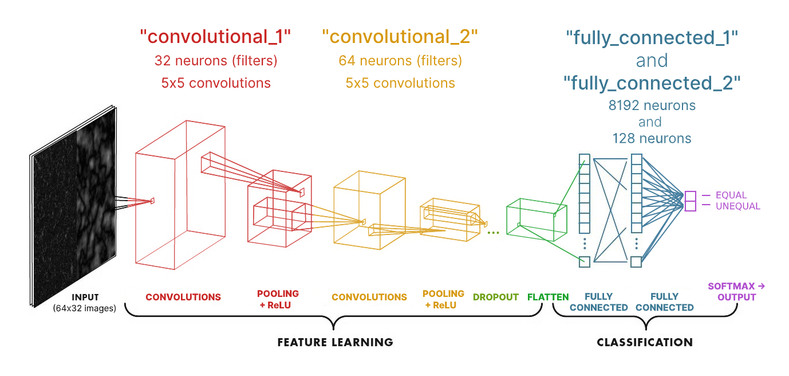

# 📼 VHS Stitcher

This application is being created for my Robot Vision class, ECE 4881 at the University of Michigan-Dearborn.

# 📄 Report

## Introduction and project goals
I’m converting home video VHS tapes to digital video files, but the recording program requires me to record in chunks, which makes me pause the VCR to handle. When the video resumes, an overlay is left on the video, which I’ve been getting around by rewinding the tape on the next chunk so that the overlay disappears by the time it reaches the same frame the previous chunk ended on. Because it's tedious to stitch multiple video chunks together to eliminate the overlays in iMovie, I want to write a program to automate this task.

I brainstormed this plan to solve this problem before researching and beginning work:

1. Teach a neural network how to recognize if two images are equal, ignoring any noise or VCR overlays on top of either
2. Scan the beginning and end of the two given video files, and pass the frames into the network to find where the overlap is
3. Use this information to generate a timestamp for where to stop the first video and where to continue from the second perfectly

I didn't deviate much from this plan to the final product, but I knew if I had trouble with the neural network that I would fall back to traditional image processing techniques. Fortunately, the network performed exceptionally because it was a reasonably simple task.

## Implementation and application usage
This project is written in version 3 of Python only.

### Creating a command line interface
First, every feature of the application, which will be described in upcoming sections, has its own Python file: `extract.py`, `match.py`, `assemble.py`, `train.py`, and `combine.py`. This is just good programming practice (to break up semi-unrelated things in to different files), but doing this also made it easy to run each file as its own program on the command line, using a library from Google called [`fire`](https://github.com/google/python-fire).

For instance, `python extract.py video1.mp4 video2.mp4` calls the `main` function in `extract.py` with arguments `chunk_1="video1.mp4"` and `chunk_2="video2.mp4"`. 

For my taste, this could still be improved upon, so I made the `stitch` (macOS and Linux) and `stitch.cmd` (Windows) scripts to wrap the Python command conveniently. These make the above command equivalent to `./stitch extract video1.mp4 video2.mp4`.

To be explicit as possible, when a command is referred to in the upcoming sections as `stitch X`, the associated source code file is located in the `vhs_stitcher` directory as `X.py`

### Extracting frames from the end of one chunk and start of the next: `stitch extract`

This command extracts frames from the start/end of the given video files in preparation for labeling them as training data. This also provides functionality that will be needed again in `stitch combine`, the most important command (the whole reason the project was done) that will be discussed last.

The extract command accepts two file arguments: `chunk_1`, which contains a video stream that comes before the other parameter, `chunk_2`, which comes after the video stream in `chunk_1`.

The program reads in the last 90 seconds of `chunk_1` with the [`imageio`](https://imageio.github.io/) library and an FFMPEG plugin for it and reads the video frames as individual images. I chose 90 seconds because it should allow a good range for overlap between the two videos instead of constraining too much. If the video is 720x480 pixels, then each frame-image is saved unmodified as 720x480 pixels to the `data/extracted_frames/ending/` directory. They are named as 0.jpg, 1.jpg, 2.jpg, and so on up to ~2700.jpg (because there are 90 seconds of video and 30 frames per second), where  0.jpg is 90 seconds from the end and 2700.jpg is the end of the video.

The same is done for `chunk_2`, but saved to the `data/extracted_frames/continuing/` and where 0.jpg is the start of the video and ~2700.jpg is 90 seconds into the video.

Here's what that looks like:
 
 

<figcaption style="text-align: center">The first frames from the continuing video, chunk_2. </figcaption>

 

<figcaption style="text-align: center">Frames from the ending video, chunk_1 

Notice we had to scroll down to image ~1600 to find the same frames as in the continuing video!</figcaption>

### Manually labeling frame data: `stitch match`
Now that the extracted frames have been viewed in the file explorer and there's some vague idea of where the two overlap in their contents, it is time to critically look for equivalent images by number to pair them up.

In the previous example, close examination revealed that continuing image 0.jpg corresponds to 1585.jpg. These are the start of each range. The end of the ending range is 2698.jpg, which mathematically has to correspond to continuing image 1113.jpg because each range much be the same size, or else the user is warned to check their math and frames again.

With two complete ranges 1585:2698 and 0:1113, we can generate 1114 total matches by calling `stitch match 1585:2698 0:1113`, which generates a unique ID for each match and moves the images to a new folder with that name.

Here's what one matched pair looks like:
 
 

<figcaption style="text-align: center">A pair of equivalent images. They differ only in noise and some distortion caused by the VCR</figcaption>

This command should be run multiple times with different video recordings to assemble a database that covers many different image contents. The code is currently written to expect a minimum of 3000 matches.

### Assembling training and test sets: `stitch assemble`
Because it would help the neural network out a ton to have its inputs preprocessed and simplified before it must work on them, this step does exactly that. It also organizes the processed images into properly sized training and test sets, each divided into equal paired images and unequal paired images.

First, the list of match IDs is compiled from the `data/matches` directory. 2500 of them are selected to make a `training_equals` set. 4000 permutations (i.e. 2 strictly different IDs) are selected to make a `training_unequals` set. 

The test sets are made by doing the same thing, but they are checked not to have entries that are in the training sets: 500 match IDs are selected to make a `test_equals` set, and 500 permutations are selected to make a `test_unequals` set.

At this point, these sets are just lists of strings (file paths) in memory, so another function `create_and_save_records` is called to convert that information into actual images in the `data/test` and `data/training` (each with an `equal` and `unequal` directory inside) directories. This function iterates all the string-sets and loads each entry's images into memory to preprocess them with `create_image_comparison`.

`create_image_comparison` immediately resizes each image to a 128x128 pixel square, and compares the given images on two levels: 
1. Color information: a 4px Gaussian blur is applied to each image, which is enough to remove noise and edges
2. Edge information: [the `FIND_EDGES` convolution](https://github.com/python-pillow/Pillow/blob/master/src/PIL/ImageFilter.py#L289-L293) uses a convolution of 8 surrounded by -1s to find the edges in each image

By compare, I mean that one image's results is subtracted from the other to find where they differ. Then, they are downscaled to 32x32 px and converted to grayscale to make it easier for the neural network to learn from this information. All of these image processing effects are powered by [PIL / Pillow](https://python-pillow.org/).

The results are horizontally stacked (i.e. set next to each other) so that the network can see both the edge differences and color differences at the same time, and then saved to the appropriate set directory.

Here are some cherrypicked records to show what the neural network will have to deal with and make decisions from:
 
 

<figcaption style="text-align: center">The first equal image is almost nearly black except for a VCR overlay (which we want the neural network to learn should be ignored). On the left half of each is the difference of edges, and on the right is the difference of colors.

The second equal image is nearly black too; some noise remains.

The first two unequal images, and last three, are really dark, which means they must have been compared against really similar frames. The neural network needs to be precise, so it is taught that these are absolutely not the same.

The remaining unequal images are pretty clearly different.
</figcaption>

### Training the neural network: `stitch train`
#### Convolutional neural network (CNN) architecture

<figcaption style="text-align: center">Annotated layers of the convolutional neural network. 

This diagram has been modified from <a href="https://towardsdatascience.com/a-comprehensive-guide-to-convolutional-neural-networks-the-eli5-way-3bd2b1164a53">this blog post.</a></figcaption>

TODO

#### Adversity
Coming up with that model (neural network design) was easy, since it was pretty much identical to what we talked about in class, but implementing it in code provided between hours and days of challenges.

The first setup that I managed to get to work, practically unmodified from the [`thinc` library's intro tutorial](https://colab.research.google.com/github/explosion/thinc/blob/master/examples/00_intro_to_thinc.ipynb#scrollTo=liOTpmsYyxma&line=8&uniqifier=1) started at 9% accuracy because it looks at inputs as flat arrays instead of as 2D matrices. So, I tossed that setup and scoured `thinc`'s websites for examples of CNNs, but [the only one it has is for natural language processing (NLP)](https://github.com/explosion/thinc/blob/master/examples/03_pos_tagger_basic_cnn.ipynb), which is either totally unrelated to image processing CNNs or the two are deeply linked in a way that is beyond my understanding. 

Because I was not able to make a CNN with `thinc`'s provided layer types, I began to look in to [PyTorch](https://pytorch.org/), a more mature and mainstream library that has many more tutorials available and built-in support for 2D image processing, including pooling and convolutional filter layers. The greatest thing is that the only thing about my code I had to change was my model, because the `thinc` library includes a [PyTorchWrapper](https://thinc.ai/docs/usage-frameworks) that makes PyTorch models fully compatible with `thinc` training, testing, prediction, and storage (i.e. to and from disk).

Unfortunately, once I switched from a `thinc` model to a PyTorch model, the program began to [segmentation fault](https://en.wikipedia.org/wiki/Segmentation_fault) on my main computer, with an AMD processor on macOS. So, I had to continue with the project using my slower Windows laptop with an Intel processor. 

A first attempt with PyTorch ([adapted from this example](https://github.com/pytorch/examples/blob/master/mnist/main.py#L11)) brought the network to 83% accuracy, then some revisions (changing around parameters like number of convolutional filters and fully connected layer neurons) brought it to 86%, then again up to 90%. I chose to take a closer look at the predictions the network was making and saw that they were the **same for every input it got, as though it were completely blindly guessing**, making the accuracy measurements I was getting **meaningless**. I couldn't find out what was wrong with my code from looking at it, so I searched the internet for possible reasons: the model needs [fewer neurons](https://stackoverflow.com/a/26209541), and/or [the data needs to be reshaped / reformatted](https://stackoverflow.com/a/55730402). Changing up the model made me mistakenly add a sigmoid activation function where it shouldn't have been, but I didn't know this was a problem until I fixed the data shape, so when I removed it again, I immediately got a real (i.e. the neural network was able to "see" the inputs and give reasonable and different outputs for each) 94% accuracy!

Once these more major problems were solved, another was able to come to light: the network gets incredibly overconfident quickly. This is fair because it's right 100% of the time after being exposed to 700 images (or 1/3 of the training set), but I would still like more discretion and admittance of defeat for the hardest cases. To try to achieve this, I looked into modifying the loss function, which the neural network is always trying to minimize, to heavily penalize overconfident wrong answers (which should result in rewarding unconfident answers). [This article](https://medium.com/udacity-pytorch-challengers/a-brief-overview-of-loss-functions-in-pytorch-c0ddb78068f7) describes *mean square error loss* as (Yh-Y)² (where Yh means prediction and Y means truth) and "penalizes the model when it makes large mistakes and incentivizes small errors", but my testing showed absolutely no change when I modified the exponent in the `OverconfidenceLoss` function, so this problem is yet to be solved.

#### Training and testing
A training set is made by making a list of all the match IDs (folder names) in `data/training/equal` (2500 entries) and `data/training/unequal` (4000 entries), then shuffling it so that there's an even mix of equal and unequal data. This list is looped over, and an image is loaded from the path along with an array like `[0, 1]` for unequal matches and `[1, 0]` for equal matches that resembles the kind of output softmax will give. The same thing is also done for the test set in the `data/test/equal` (500 entries) and `data/test/unequal` directories (500 entries).

I decided to run 50 epochs to train and test the neural network because it seems like a good number. Each epoch, 1/50th of the training set is fed into the CNN, which gives back predictions for these inputs. We pass the predictions and truths to the `OverconfidenceLoss` function to calculate loss and gradients, then backpropagate these. 

Right after this, the NN is tested on 1/50th of the test set, and its predictions are compared against the truths. If the prediction's best guess (i.e. largest output) matches the true answer, then that is counted as a correct answer. A running total is kept of the ratio of correct answers to total questions, and it is shown as a progress bar so we can keep track of it mostly gradually increasing over time. 

### Bringing it all together: automatically combine two VHS recordings with `stitch combine`
This is where all the work done with the previously described commands pays off. Once those commands have been run (and the accuracy of the network is satisfactory), **they never need to be run again**.

First, the previously described `extract` command is used again here under the hood to extract the given `chunk_1` and `chunk_2` video files's frames of their last/first 90 seconds respectively. Then, every frame from `chunk_2` is compared against 11 equally spaced samples from `chunk_1`. This means that there's one selected frame for every 10% of video (9 seconds), so it is assumed there is at least 9 seconds of overlap between the two videos to be found.

A comparison image, previously described in the `assemble` section, is made of each frame pair and fed into the trained neural network to make a prediction of the similarity between the two. After all frame pairs are compared, the one with the highest predicted similarity is chosen to be the point to cut off the first chunk and resume from the second. These frame numbers are converted to a timestamp for the first chunk and another for the second chunk.

These timestamps are used to generate an FFMPEG command that combines the two video chunks into a new `output` (parameter passed after `chunk_1` and `chunk_2`) video file. It also prints out the timestamp in the output video to tell the user to see how the match is.

## Conclusion
I tested the `combine` command on a fresh VHS tape (i.e. the neural network had never seen it before) and it correctly found a *perfect* matching frame pair to combine/stitch at. I reviewed the result and saw that it chose to frame where the camera was moving quickly, so if it had been off by even a little bit, a stutter (skipping ahead of repeating already seen frames) would've been noticeable. In actuality, the stitcher *nailed it*.

I've been a programmer for a long time but I've historically actively avoided working with artificial intelligence (AI) / neural networks / machine learning (ML), image processing, or data and numerical analysis stuff. **This project, and class as a whole, has empowered me to continue down this continue down this path with experience.** One area I may apply this knowledge next is "smartening up" my security system with neural networks, an idea I came up with originally doing for this project but rejected. 

## Appendix

The source code associated with this project is included as a zip archive attached to the Canvas submission. 

It will also available to browse publicly on [GitHub here](https://github.com/babichjacob/vhs-stitcher) on Sunday at 11:59 PM alongside project submission.
